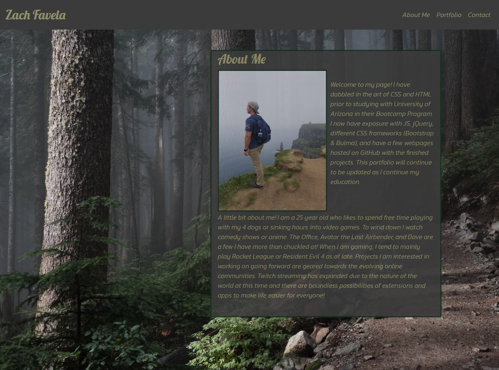
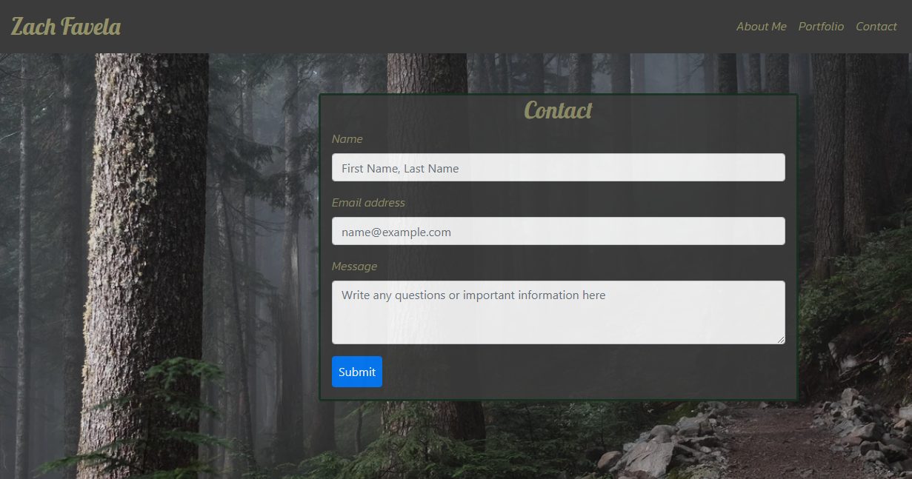

# Responsive Portfolio

Welcome to my portfolio! Spanning multiple pages is some information about me, what I am learning, and some of the projects I have been working on!

## Style

I chose a simple background that would look nice on all pages. The contact card and portfolio pages are updated including a link to currently active projects and my GitHub. New update includes projects on portfolio page which is displayed using a carousel. Check it out below:

## Come See

Click [here](https://zacharybinx.github.io/starting-portfolio/) to take a look!